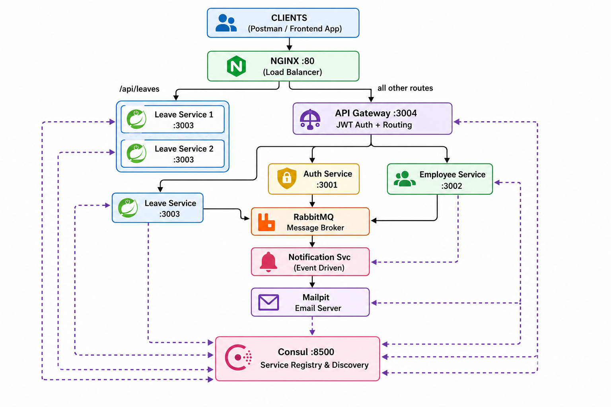

# Leave Management System NAGP — Microservices Architecture

## Table of Contents
1. [Project Overview](#project-overview)
2. [Architecture](#architecture)
3. [Microservices](#microservices)
4. [Design Patterns](#design-patterns)
5. [Tech Stack](#tech-stack)
6. [Prerequisites](#prerequisites)
7. [Quick Start](#quick-start)
8. [Services & Ports](#services--ports)
9. [API Documentation](#api-documentation)
10. [Inter-Service Communication](#inter-service-communication)
11. [Cross-Cutting Concerns](#cross-cutting-concerns)
12. [Docker Hub Images](#docker-hub-images)
13. [Production Improvements](#production-improvements)
14. [Demo Video](#demo-video)

---

## Project Overview

A fully distributed **Employee Leave Management System** built using 
microservices architecture. The system allows:

- **Employees** to apply for leaves, view balances, track history
- **Managers** to approve/reject team leave requests
- **Automatic notifications** on all leave actions via email
- **Full observability** via centralized logging and distributed tracing

### Key Highlights:
- 5 independent microservices
- JWT-based authentication & role-based authorization
- Pre-seeded users (Manager + Employee) with auto-initialized leave balances
- Service registry & discovery using Consul
- Rate limiting (100 req/min per token) in API Gateway
- Saga pattern for distributed transactions (leave approval workflow)
- Circuit breaker for fault tolerance
- Load balanced leave service (2 instances via Nginx)
- Centralized logging with ELK Stack
- Distributed tracing with Jaeger
- Email notifications with Mailpit
- Single command startup with Docker Compose

---

## Architecture




---

## Microservices

### 1. API Gateway (:3004)
- Single entry point for all client requests
- JWT token validation
- Role-based authorization checks
- Request routing to appropriate services
- Rate limiting (100 req/min per token)
- Distributed tracing (OpenTelemetry → Jaeger)

### 2. Auth Service (:3001)
- User login with JWT token generation
- Pre-defined users (employees + managers)
- Automatic leave balance initialization via RabbitMQ events
- MongoDB for user storage

### 3. Employee Service (:3002)
- Employee profile management
- Leave balance tracking (Casual: 12, Sick: 10, Privilege: 15)
- Balance deduction/restoration (called by Leave Service)
- Listens to `user.created` events from Auth Service

### 4. Leave Service (:3003) — 2 instances
- Apply for leave with full validation
- Manager approval/rejection workflow
- **Saga Pattern** for approval (with compensation)
- **Circuit Breaker** for Employee Service calls
- Publishes events to RabbitMQ
- Load balanced via Nginx (2 instances)

### 5. Notification Service (no port)
- Pure event-driven — no HTTP server
- Listens to RabbitMQ events
- Sends HTML emails via Mailpit SMTP
- Handles: applied, approved, rejected, failed events

---

## Design Patterns

### 1. API Gateway Pattern

All clients → API Gateway (single entry point)
→ Handles: Auth, Rate limiting, Routing
→ Injects user context as headers (X-User-Id, X-User-Role)
→ Services don't need JWT logic


### 2. Service Registry & Discovery (Consul)

Each service registers on startup
→ TTL heartbeat (local dev)
→ HTTP health check (Docker)
Services discover each other via Consul lookup
→ No hardcoded URLs in production


### 3. DB per Service Pattern

Auth Service     → mongodb-auth:27017
Employee Service → mongodb-employee:27018
Leave Service    → mongodb-leave:27019
→ Complete data isolation
→ Services communicate via APIs only
→ No shared database


### 4. Saga Pattern (Orchestration)

Leave Approval Workflow:
Step 1: Update leave status → Approved
Step 2: Deduct leave balance (Employee Service)
Step 3: Send notification (RabbitMQ)
Compensation on failure:
Step 2 fails → Revert leave to Pending
→ Notify employee of failure


### 5. Circuit Breaker Pattern
Leave Service → Employee Service calls
→ opossum library
→ Opens after 50% failure rate
→ Fallback: "Service temporarily unavailable"
→ Half-open: tests recovery after 10s
→ Prevents cascading failures


### 6. Async Messaging (Event-Driven)

Events via RabbitMQ (topic exchange):
user.created      → Employee Service creates profile
leave.applied     → Notification Service emails employee + manager
leave.approved    → Notification Service emails employee
leave.rejected    → Notification Service emails employee
leave.approval.failed → Notification Service emails employee


### 8. Load Balancing (Nginx)

Leave Service runs 2 instances
Nginx distributes requests round-robin:
→ leave-service-1:3003
→ leave-service-2:3003


---

## Tech Stack

| Category | Technology |
|---|---|
| Runtime | Node.js 20 (Alpine) |
| Framework | Express.js |
| Database | MongoDB 7.0 (per service) |
| Message Broker | RabbitMQ 3 |
| Service Registry | Consul 1.15 |
| Load Balancer | Nginx Alpine |
| Authentication | JWT (jsonwebtoken) |
| Circuit Breaker | opossum |
| Logging | Winston + ELK Stack |
| Tracing | OpenTelemetry + Jaeger |
| Email | Nodemailer + Mailpit |
| Containerization | Docker + Docker Compose |

---

## Prerequisites

- Docker Desktop with WSL2 OR Docker on Linux
- Git
- Postman (for API testing)

**No Node.js installation required!**
Everything runs in Docker containers.

---


## Services & Ports

| Service | Internal Port | External Port |
|---|---|---|
| Nginx | 80 | 80 |
| API Gateway | 3004 | 3004 |
| Auth Service | 3001 | 3001 |
| Employee Service | 3002 | 3002 |
| Leave Service 1 | 3003 | 3003 |
| Leave Service 2 | 3003 | 3005 |
| Notification Service | - | - |
| Consul | 8500 | 8500 |
| RabbitMQ | 5672 | 5672 |
| RabbitMQ UI | 15672 | 15672 |
| MongoDB Auth | 27017 | 27017 |
| MongoDB Employee | 27017 | 27018 |
| MongoDB Leave | 27017 | 27019 |
| Elasticsearch | 9200 | 9200 |
| Kibana | 5601 | 5601 |
| Logstash | 5000 | 5000 |
| Jaeger | 16686 | 16686 |
| Mailpit | 8025 | 8025 |

---

## Pre-defined Users

| Name | Email | Password | Role |
|---|---|---|---|
| Pankaj | pankaj@nagarro.com | Pankaj123 | Manager |
| Ankit Singh | ankit.singh14@nagarro.com | Ankit123 | Employee |

### Leave Balances (auto-initialized):
| Leave Type | Days |
|---|---|
| Casual Leave | 12 days |
| Sick Leave | 10 days |
| Privilege Leave | 15 days |

---

## API Documentation

Base URL: `http://localhost:3004` (via Gateway)
OR
Base URL: `http://localhost` (via Nginx)

### Authentication
All endpoints (except login) require:
Authorization: Bearer <jwt_token>

### Endpoints

#### Auth
| Method | Endpoint | Auth | Description |
|---|---|---|---|
| POST | /api/auth/login | ❌ | Login and get JWT token |

#### Employee
| Method | Endpoint | Auth | Role | Description |
|---|---|---|---|---|
| GET | /api/employees | ✅ | Manager | Get all employees |
| GET | /api/employees/:userId | ✅ | Own/Manager | Get employee profile |
| GET | /api/employees/:userId/balance | ✅ | Own/Manager | Get leave balance |

#### Leave
| Method | Endpoint | Auth | Role | Description |
|---|---|---|---|---|
| POST | /api/leaves | ✅ | Employee | Apply for leave |
| GET | /api/leaves | ✅ | Any | View leaves (filtered by role) |
| GET | /api/leaves/:leaveId | ✅ | Any | Get specific leave |
| PUT | /api/leaves/:leaveId/approve | ✅ | Manager | Approve leave (Saga) |
| PUT | /api/leaves/:leaveId/reject | ✅ | Manager | Reject with reason |
| PUT | /api/leaves/:leaveId/cancel | ✅ | Employee | Cancel pending leave |

### Query Parameters (GET /api/leaves)
| Parameter | Description | Example |
|---|---|---|
| status | Filter by status | ?status=pending |
| employeeId | Filter by employee (manager) | ?employeeId=xxx |
| startDate | Filter from date | ?startDate=2026-06-01 |
| endDate | Filter to date | ?endDate=2026-06-30 |
| page | Page number | ?page=2 |
| limit | Items per page | ?limit=10 |

---

## Synchronous Communication (HTTP via Consul)

### API Gateway → Auth Service

| Method | Endpoint      | Purpose |
|----------|--------------|----------|
| POST | `/auth/login` | User authentication |

### API Gateway → Employee Service

| Method | Endpoint | Purpose |
|----------|----------|----------|
| GET | `/employees` | Get all employees |
| GET | `/employees/:userid/balance` | Get employee leave balance |

### API Gateway → Leave Service

| Method | Endpoint | Purpose |
|----------|----------|----------|
| POST | `/leaves` | Apply for leave |
| GET | `/leaves` | Get leave requests |
| PUT | `/leaves/:id/approve` | Approve leave request |
| PUT | `/leaves/:id/reject` | Reject leave request |

### Internal Service-to-Service Communication

#### Leave Service → Employee Service

| Method | Endpoint | Purpose |
|----------|----------|----------|
| GET | `/employees/:id/balance` | Validate leave balance before applying |
| PUT | `/employees/:id/balance/deduct` | Deduct balance after leave approval (Saga Step 2) |
| PUT | `/employees/:id/balance/restore` | Restore balance during Saga compensation |


### Asynchronous (RabbitMQ - topic exchange: lms_exchange):

| Publisher        | Routing Key             | Consumer              |
|------------------|--------------------------|-----------------------|
| Auth Service     | `user.created`           | Employee Service      |
| Leave Service    | `leave.applied`          | Notification Service  |
| Leave Service    | `leave.approved`         | Notification Service  |
| Leave Service    | `leave.rejected`         | Notification Service  |
| Leave Service    | `leave.approval.failed`  | Notification Service  |


## Service Discovery Flow (Consul)

### Registration

When a service starts:

1. Registers itself with Consul
   - Service name
   - Host
   - Port
   - Health check endpoint
2. Consul stores the service information in its registry.
3. Consul performs health checks every **10 seconds** to ensure the service is available.

### Service-to-Service Discovery

When **Service A** needs to communicate with **Service B**:

1. Service A queries Consul:
   ```
   Where is service-b?
   ```
2. Consul returns the registered instance details:
   ```
   host:port
   ```
3. Service A makes the HTTP request directly to Service B.

### Fallback Mechanism

If Consul is unavailable or service discovery fails:

1. Service A falls back to a predefined environment variable.
2. The environment variable contains the direct URL of Service B.
3. Service A continues communication using the fallback URL.

### Flow Diagram

```text
Service Startup
      │
      ▼
Register with Consul
(name, host, port, health check)
      │
      ▼
Consul Registry
      │
      ├── Health Check Every 10s
      ▼
Healthy Service

Service A Needs Service B
      │
      ▼
Query Consul
("where is service-b?")
      │
      ▼
Consul Returns
host:port
      │
      ▼
HTTP Request to Service B
      │
      ▼
Response

If Consul Fails
      │
      ▼
Use Environment Variable URL
      │
      ▼
HTTP Request to Service B
```


## Cross-Cutting Concerns

### 1. Authentication & Authorization
JWT Token contains: userId, email, role, managerId
Gateway validates token on every request
Injects as headers: X-User-Id, X-User-Role, X-User-Name
Services read headers (no JWT logic in services)
Role checks: Employee (own data) | Manager (team data)


### 2. Centralized Logging (ELK Stack)
All services → Winston logger
Winston → TCP → Logstash:5000
Logstash → Elasticsearch:9200
Kibana → search/visualize at :5601
Index pattern: lms-logs-*
Fields: service, level, message, timestamp, metadata


### 3. Distributed Tracing (Jaeger)
API Gateway + Leave Service → OpenTelemetry SDK
Auto-instruments: Express routes, HTTP calls, Axios
Traces exported to Jaeger:14268
View at: http://localhost:16686
TraceID propagated across services via headers


### 4. Circuit Breaker (opossum)
Leave Service wraps Employee Service calls:

checkBalanceCB: GET /balance
deductBalanceCB: PUT /balance/deduct
restoreBalanceCB: PUT /balance/restore

Settings:

timeout: 3000ms
errorThreshold: 50%
resetTimeout: 10000ms
volumeThreshold: 3 requests

States: CLOSED → OPEN → HALF-OPEN → CLOSED

### 5. Global Error Handling
Each service has errorHandler middleware
Catches: ValidationError, MongoError, JWTError, general errors
Returns: { success: false, message: "..." }
Proper HTTP status codes throughout

### 6. Health Checks
All services expose: GET /health
Returns: { status: "UP", service: "name", timestamp, uptime }
Consul monitors via HTTP health checks (Docker)
TTL heartbeat for local development

---

## Docker Hub Images

All images available at: https://hub.docker.com/u/riolog27

| Service | Image | Tag |
|---|---|---|
| API Gateway | riolog27/lms-api-gateway | 1.2 |
| Auth Service | riolog27/lms-auth-service | 1.3 |
| Employee Service | riolog27/lms-employee-service | 1.3 |
| Leave Service | riolog27/lms-leave-service | 1.3 |
| Notification Service | riolog27/lms-notification-service | 1.2 |

### Pull and run using Docker Hub images:
```bash
# Images are referenced in docker-compose.yml
# Just run:
docker compose up -d
# Docker automatically pulls images if not present locally
```

---

## Production Improvements

The current implementation is designed for local development and demonstration purposes. The following enhancements would be recommended for a production-ready deployment.

### 1. Shared Code Management

**Current**
- `shared/` folder copied into each service via Dockerfile

**Production**
- Publish shared utilities as a private package (e.g., `@lms/common`)
- Install in each service using:
  ```bash
  npm install @lms/common
  ```
- Centralized versioning
- Single source of truth
- Easier dependency management across services

---

### 2. Security

**Current**
- JWT secret stored in `.env` files

**Production**
- HTTPS/TLS for all external and internal traffic
- Refresh token mechanism
- Centralized secret management and auditing

---

### 3. Database

**Current**
- MongoDB running in containers with Docker volumes

**Production**

- Self-hosted MongoDB replica set
- Automated backups and disaster recovery
- Read replicas for scaling read workloads
- Monitoring and performance tuning
- High availability configuration

---

### 4. Message Queue

**Current**
- Single RabbitMQ instance

**Production**
- RabbitMQ cluster 
- High Availability (HA) queues
- Dead Letter Queue (DLQ) support
- Message retry strategies
- Message TTL policies
- Queue monitoring and alerting

---

### 5. Scaling

**Current**
- Two Leave Service instances behind Nginx

**Production**
- Kubernetes Horizontal Pod Autoscaler (HPA)
- Horizontal scaling for all services
- Stateless service design
- Independent scaling per service
- Database-per-service pattern
- Resource-based auto-scaling

---

### 6. CI/CD

**Current**
- Not implemented (out of scope)

**Production**
- GitHub Actions pipeline
- Automated unit and integration testing
- Docker image build on merge
- Vulnerability scanning
- Automated Kubernetes deployment
- Rollback support
- Blue/Green or Canary deployments

---


## Environment Variables

| Variable | Description | Required | Default |
|---|---|---|---|
| JWT_SECRET | JWT signing secret (use ankitsinghsecretkeynagpassignemnt) | ✅ | - |
| JWT_EXPIRY | Token expiration | ❌ | 24h |

All other variables are pre-configured in docker-compose.yml.

---

## Troubleshooting

### Services not starting:
```bash
# Check logs:
docker compose logs -f <service-name>

# Restart specific service:
docker compose restart <service-name>
```

### Port already in use:
```bash
# Stop all containers:
docker compose -f docker-compose.prod.yml down

# Start fresh:
docker compose -f docker-compose.prod.yml up -d
```

### Full reset (clear all data):
```bash
docker compose -f docker-compose.prod.yml down -v

docker compose -f docker-compose.prod.yml up -d
```

---


# Quick Start

## Option 1 — Run from Source Code (Development)

### 1. Clone the Repository

```bash
git clone https://github.com/RIOLOG/Leave-Management-Portal-NAGP.git
cd Leave-Management-Portal-NAGP
```

### 2. Create Environment File

```bash
cp .env
(env. file is present in submission checklist folder)
```

### 3. Start All Services

```bash
docker compose up -d
```

---

## Option 2 — Run from Docker Hub Images


No source code is required. Only Docker and Docker Compose need to be installed.

### 1. Copy the Deployment Package

This folder is present in submission checklist folder as named (docker-compose.prod.yml)

```text
docker-compose.prod.yml/
├── docker-compose.prod.yml
├── .env
└── infrastructure/
    ├── nginx/
    │   └── nginx.conf
    └── elk/
        └── logstash.conf
```

### 2. Navigate to the Deployment Directory

```bash
cd path/to/docker-compose.prod.yml
```

### 3. Start the Complete System

```bash
docker compose -f docker-compose.prod.yml up -d
```

Docker will automatically pull all required images from Docker Hub, including:

* Infrastructure images (MongoDB, RabbitMQ, Consul, Nginx, etc.)
* Application service images (e.g., `riolog27/lms-auth-service:1.3`)

### 4. Monitor Initialization

Track the startup process of the authentication service:

```bash
docker compose -f docker-compose.prod.yml logs -f auth-service
```

Wait until the following messages appear:

```text
✅ MongoDB connected
✅ Connected to RabbitMQ
✅ Users seeded successfully!
✅ Event published: user.created
```

### 5. Verify Running Containers

```bash
docker ps
```

You should see all containers running with the status:

```text
Up
```

### 6. Access the System

| Service                      | URL                    |
| ---------------------------- | ---------------------- |
| API Gateway                  | http://localhost:3004  |
| Nginx (Load Balancer)        | http://localhost       |
| Consul UI                    | http://localhost:8500  |
| RabbitMQ Management UI       | http://localhost:15672 |
| Kibana (Logs)                | http://localhost:5601  |
| Jaeger (Distributed Tracing) | http://localhost:16686 |
| Mailpit (Email Testing)      | http://localhost:8025  |

**RabbitMQ Credentials**

```text
Username: guest
Password: guest
```

### 7. Stop the Application

```bash
docker compose -f docker-compose.prod.yml down
```

### 8. Reset the Environment (Remove All Data)

```bash
docker compose -f docker-compose.prod.yml down -v
docker compose -f docker-compose.prod.yml up -d
```

---

## Notes

* First startup may take several minutes while Docker downloads all required images.
* Ensure ports `80`, `3004`, `8500`, `15672`, `5601`, `16686`, and `8025` are available on the host machine.
* For a clean environment reset, use the reset commands provided above.


## Demo Video
https://drive.google.com/file/d/17ajEmgu_Cfm4B5_oPu5V-g7jWprZbzoR/view?usp=sharing

---

## GitHub Repository
https://github.com/RIOLOG/Leave-Management-Portal-NAGP

---

## Author
Ankit Singh | NAGP Microservices Assignment 2026
